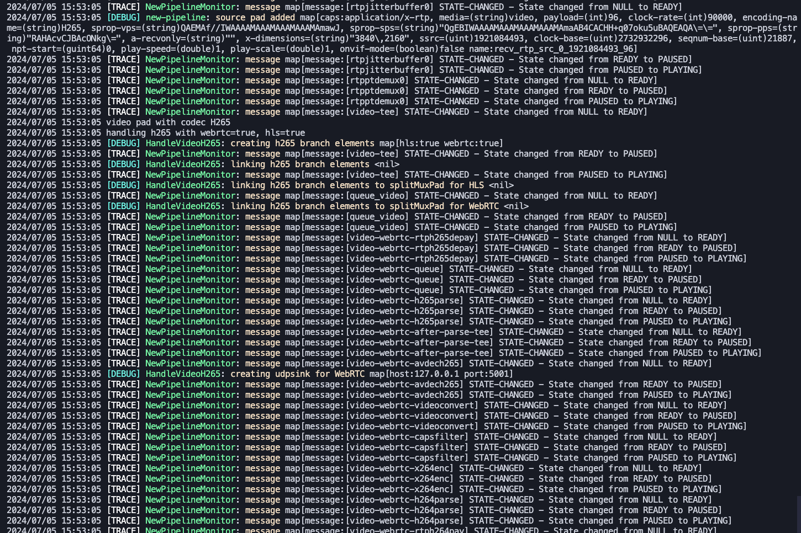

# Logging with golang

This package provides the ability to use multiple logging output methods.

🚀 Included loggers:

* Console  

* Elasticsearch 

## Installing

```bash
go get -u github.com/mateothegreat/go-multilog
```

## Defining a custom logger

```go
package main

import (
	"log"

	"github.com/mateothegreat/go-multilog/multilog"
)

type CustomLogData struct {
	Foo string `json:"foo"`
	Bar int    `json:"bar"`
}

func init() {
	multilog.RegisterLogger(multilog.LogMethod("console"), multilog.NewConsoleLogger(&multilog.NewConsoleLoggerArgs{
		Format: multilog.FormatText,
	}))

	multilog.RegisterLogger(multilog.LogMethod("elasticsearch"), multilog.NewElasticsearchLogger(&multilog.NewElasticsearchLoggerArgs{
		Addresses:          []string{"https://localhost:9200"},
		Username:           "elastic",
		Password:           "elastic",
		Index:              "logs-1",
		InsecureSkipVerify: true,
	}))

	multilog.RegisterLogger(multilog.LogMethod("customerLogger1"), &multilog.CustomLogger{
		Log: func(level multilog.LogLevel, group string, message string, v any) {
			log.Printf("logged via customerLogger1: %s: %s", group, message)
		},
	})

	// Register a custom logger:
	customLogger1 := multilog.NewLogger(multilog.LogMethod("customerLogger2"))
	// If needed, you can do stuff here when the logger is setup such as
	// connecting to something like elasticsearch or whatever:
	customLogger1.Setup = func() {
		log.Println("Setup customerLogger2")
	}
	// Define the log method:
	customLogger1.Log = func(level multilog.LogLevel, group string, message string, v any) {
		log.Printf("logged via customerLogger: %s: %s", group, message)
	}
}

func main() {
	multilog.Debug("my_package_name", "test", CustomLogData{
		Foo: "foo",
		Bar: 1,
	})
	multilog.Warn("my_package_name", "it's about to explode...", CustomLogData{
		Foo: "boom",
		Bar: 1234234234234,
	})

	multilog.Error("my_package_name", "some error!", CustomLogData{
		Foo: "bad things happened bro",
		Bar: 123,
	})
}
```
